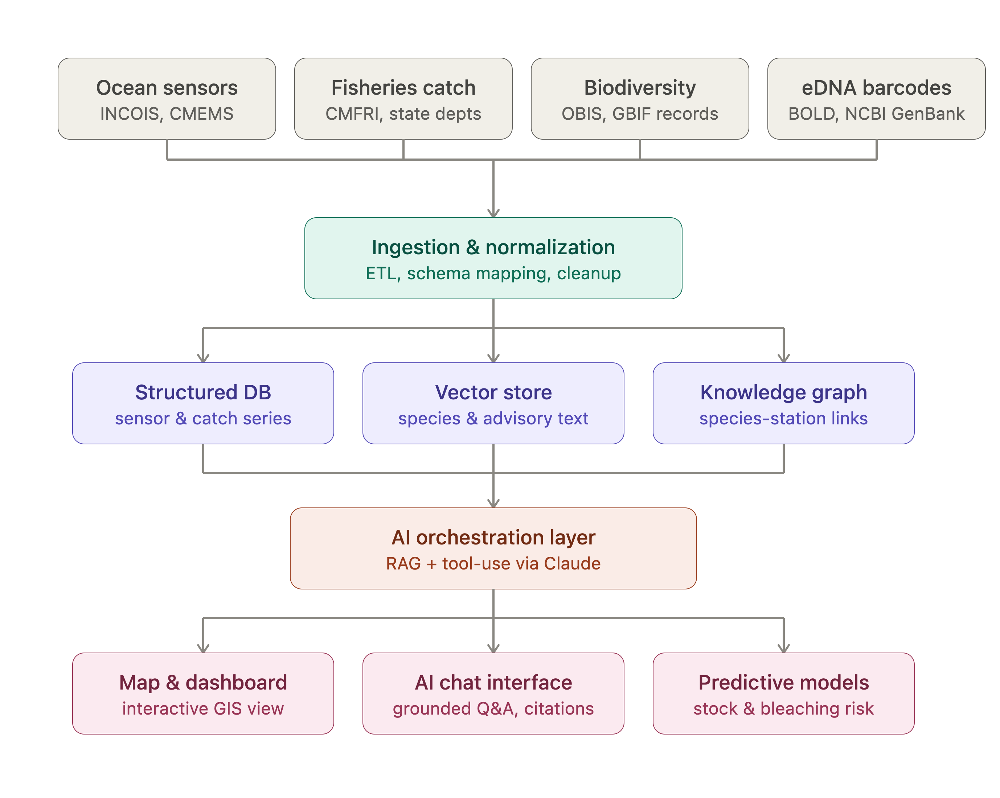

# SAMUDRA

### An AI-Driven Unified Data Platform for Oceanographic, Fisheries, and Molecular Biodiversity Insights

_Built for Smart India Hackathon — Problem Statement SIH25041_

---

## The problem

India has one of the world's largest coastlines and one of its most economically important fishing sectors — and the data needed to manage it well already exists. It's just scattered.

Ocean temperature and current data lives with INCOIS. Fish catch statistics live with CMFRI and state fisheries departments. Species occurrence and biodiversity records live in OBIS and GBIF. Molecular data from eDNA barcoding lives in academic bioinformatics pipelines and journal supplements. Pollution and coastal treatment plant compliance data lives with CPCB. Vessel activity is tracked by satellite AIS systems that few coastal agencies actually monitor in real time.

Each of these datasets is maintained well by the agency responsible for it. None of them talk to each other. So a question as simple as _"is the sardine decline near Kochi connected to rising sea temperature, and are we seeing early biodiversity warning signs?"_ currently requires a person to manually pull data from three or four different sources, in three or four different formats, and stitch the answer together by hand — if anyone thinks to ask the question at all.

## What researchers and agencies do today

Right now, the workflow looks roughly like this:

- **Ocean monitoring** is largely reactive reporting: buoy and satellite data gets published as raw time-series, and someone has to already know to look at it for a specific region before it becomes useful.
- **Fisheries advisories** are typically issued after a decline is already visible in catch reports — by the time an advisory goes out, the season's damage is often already done.
- **Biodiversity and eDNA data** is powerful but underused operationally. eDNA barcoding results are usually processed for a single research study, published, and then sit in a database rather than feeding into any ongoing monitoring system.
- **Pollution compliance data** is tracked separately from biodiversity and fisheries data entirely, even though effluent discharge is a well-established driver of both.
- **Illegal fishing in protected zones** is difficult to catch in practice — vessel tracking data exists globally, but cross-referencing it against India's specific marine protected area boundaries in real time isn't something most coastal teams have tooling for.

In short: the science and the sensors already exist. What's missing is a layer that connects them, reasons across them, and surfaces what matters before a person has to go looking for it.

## Proposed Architecture

## What SAMUDRA does

SAMUDRA is a single platform that unifies these data sources around one interactive map, and adds three layers of intelligence on top:

1. **A living map, not a static one.** Every ocean buoy, eDNA sampling site, fishing advisory zone, coral reef health reading, treatment plant, and tracked vessel appears as a real, clickable layer — not a PDF report or a spreadsheet export.

2. **An AI assistant grounded in real data (RAG).** Ask a question in plain English — _"why is catch declining off Kerala"_ — and the system retrieves the actual sensor readings, catch records, and species data behind the answer, then responds with a grounded, cited explanation instead of a guess. The same assistant powers natural-language search: type a question, get back the exact records that answer it.

3. **Prediction instead of just reporting.** The platform doesn't only show what already happened — it forecasts fish stock trends, calculates coral bleaching risk using real thermal-stress methodology, and projects how species ranges are likely to shift as waters warm. A scrubbable seasonal timeline lets a user watch these predictions unfold over a month, rather than reading a single static number.

On top of this, an **illegal fishing detection layer** cross-references live vessel tracking data against real marine protected area boundaries and flags activity inside restricted zones — turning the platform from purely informational into something with enforcement value.

## Datasets

| Domain                    | Source                             | What it provides                                                                  |
| ------------------------- | ---------------------------------- | --------------------------------------------------------------------------------- |
| Ocean physical parameters | INCOIS, Copernicus Marine (CMEMS)  | Sea surface temperature, salinity, chlorophyll, currents from buoys and satellite |
| Fisheries                 | CMFRI, state fisheries departments | Catch landing records by species, region, and season                              |
| Biodiversity              | OBIS, GBIF                         | Species occurrence records, geo-tagged, with conservation status                  |
| Molecular / eDNA          | BOLD Systems, NCBI GenBank         | Reference DNA barcodes used to identify species from environmental samples        |
| Vessel activity           | Global Fishing Watch               | Real-time vessel position and apparent fishing effort                             |
| Protected areas           | Protected Planet / WDPA            | Marine protected area boundaries, used to detect zone violations                  |
| Pollution & treatment     | CPCB, data.gov.in                  | Coastal sewage and effluent treatment plant locations and compliance status       |

Where a dataset can't practically be sourced in full during prototyping, the platform uses clearly labeled simulated data built on realistic patterns from the real sources above — this is stated explicitly rather than presented as live data.

## Who this is for

**Primary users:**

- **Fisheries department officials** deciding when and where to issue advisories, ideally before a stock decline rather than after
- **Marine researchers and biologists** who currently spend more time collecting and reconciling data across sources than analyzing it
- **Coastal conservation teams and MPA managers** who need to prioritize limited field-verification resources — which reef to check first, which zone to patrol

**Secondary users:**

- **Policy makers** working on India's blue economy and marine spatial planning initiatives, who need a synthesized view rather than raw datasets
- **Students and citizen scientists** who want an accessible way to explore India's marine biodiversity data

## Why this should exist now

Three things have changed recently enough that this wasn't really buildable a few years ago:

- **The underlying data has gotten genuinely open.** OBIS, GBIF, and India's own open data initiatives have made the raw datasets accessible in ways they weren't a decade ago.
- **eDNA barcoding has gotten cheap enough to be routine, not exceptional** — which means biodiversity monitoring can now happen at a frequency that makes real-time correlation with ocean and fisheries data actually useful, instead of being a one-off research exercise.
- **Language models have gotten good enough to make natural-language querying of scientific data trustworthy**, provided — critically — that the system is built to retrieve real records rather than let the model guess. That's the difference between a novelty chatbot and an operational tool.

Meanwhile, the cost of _not_ connecting this data is rising: coral bleaching events are becoming more frequent, fish stocks in several regions are under real pressure, and coastal pollution is not slowing down. The tools to catch these problems early already exist as separate datasets — they just aren't talking to each other yet.

## The pitch, in one breath

_Ocean, fisheries, and biodiversity data in India already exists — it's just scattered across agencies that don't talk to each other. SAMUDRA puts it all on one map, lets anyone ask it a question in plain language and get a real, grounded answer, and — instead of just reporting what already happened — predicts stock decline, coral bleaching risk, and species range shifts before they become a crisis. It's the difference between reading a report after the damage is done and catching the pattern while there's still time to act._

## Prototype scope — what's real vs. simulated

In the interest of not overselling a two-day build: the map, data architecture, and interaction design are real and built to scale to genuine data pipelines. The AI assistant runs a real retrieval-augmented pipeline against seeded data rather than a scripted demo. The predictive models use simplified but methodologically honest approaches (real Degree Heating Weeks logic for bleaching risk, basic regression for stock forecasts) rather than production-grade ML — appropriate for a prototype, and clearly framed as a first version rather than a finished product.

## What's next

The current build proves the architecture works end-to-end. The natural next steps are: production-grade ingestion pipelines direct from each agency's data feeds, proper time-series ML models trained on longer historical windows, and a field validation loop where verified sightings feed back into the system to improve prediction accuracy over time.
